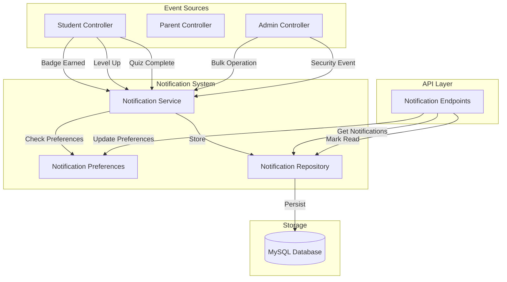

# Design Document: Notification System

## Overview

The Notification System is a core subsystem that provides real-time feedback and alerts to users across the educational platform. It supports three primary user roles: Students (gamification notifications), Parents (child progress monitoring), and Admins (system operations and security alerts).

### Key Design Goals

- **Real-time delivery**: Notifications created within 1-2 seconds of triggering events
- **Role-based targeting**: Different notification types for Students, Parents, and Admins
- **User control**: Preference management to enable/disable notification types
- **Scalability**: Support for multiple children per parent and bulk operations
- **Persistence**: 90-day retention for notification history

### System Context

The Notification System integrates with existing platform components:
- **Student Controller**: Triggers notifications on quiz completion, badge earning, level ups
- **Parent Controller**: Receives child activity and milestone notifications
- **Auth System**: Provides user authentication and role verification
- **Database**: MySQL storage for notifications, preferences, and user relationships

## Architecture

### High-Level Architecture



### Component Responsibilities

**Notification Service** (`notificationService.js`)
- Creates notifications based on event triggers
- Checks user preferences before creating notifications
- Handles parent notification fan-out (one student event → multiple parent notifications)
- Enforces business rules (e.g., streak reminders only for 3+ day streaks)

**Notification Repository** (`notificationRepository.js`)
- Database access layer for notifications table
- CRUD operations for notifications
- Query optimization for retrieval and counting
- Handles pagination

**Notification Controller** (`notificationController.js`)
- HTTP request handling for notification endpoints
- Input validation and authorization
- Response formatting

**Notification Preferences Service** (`notificationPreferencesService.js`)
- Manages user notification preferences
- Provides default preferences for new users
- Validates preference updates

### Database Schema


#### Notifications Table

```sql
CREATE TABLE notifications (
    id INT PRIMARY KEY AUTO_INCREMENT,
    user_id INT NOT NULL,
    notification_type ENUM(
        'badge_earned',
        'level_up',
        'streak_reminder',
        'child_quiz_complete',
        'child_milestone',
        'admin_operation',
        'admin_security'
    ) NOT NULL,
    title VARCHAR(255) NOT NULL,
    message TEXT NOT NULL,
    metadata JSON,
    is_read BOOLEAN DEFAULT FALSE,
    created_at TIMESTAMP(3) DEFAULT CURRENT_TIMESTAMP(3),
    FOREIGN KEY (user_id) REFERENCES users(id) ON DELETE CASCADE,
    INDEX idx_user_created (user_id, created_at DESC),
    INDEX idx_user_unread (user_id, is_read, created_at DESC)
);
```

#### Notification Preferences Table

```sql
CREATE TABLE notification_preferences (
    id INT PRIMARY KEY AUTO_INCREMENT,
    user_id INT NOT NULL UNIQUE,
    badge_earned BOOLEAN DEFAULT TRUE,
    level_up BOOLEAN DEFAULT TRUE,
    streak_reminder BOOLEAN DEFAULT TRUE,
    child_quiz_complete BOOLEAN DEFAULT TRUE,
    child_milestone BOOLEAN DEFAULT TRUE,
    admin_operation BOOLEAN DEFAULT TRUE,
    admin_security BOOLEAN DEFAULT TRUE,
    updated_at TIMESTAMP DEFAULT CURRENT_TIMESTAMP ON UPDATE CURRENT_TIMESTAMP,
    FOREIGN KEY (user_id) REFERENCES users(id) ON DELETE CASCADE
);
```

#### Student Streaks Table (New)

```sql
CREATE TABLE student_streaks (
    student_id INT PRIMARY KEY,
    current_streak INT DEFAULT 0,
    last_activity_date DATE,
    longest_streak INT DEFAULT 0,
    FOREIGN KEY (student_id) REFERENCES users(id) ON DELETE CASCADE
);
```

### API Design

#### Notification Endpoints

**GET /api/notifications**
- Description: Retrieve user's notifications with pagination
- Auth: Required (any role)
- Query params: `page` (default: 1), `limit` (default: 20)
- Response: `{ success, data: { notifications: [], total, page, totalPages } }`

**GET /api/notifications/unread-count**
- Description: Get count of unread notifications
- Auth: Required (any role)
- Response: `{ success, data: { count: number } }`

**PUT /api/notifications/:id/read**
- Description: Mark a single notification as read
- Auth: Required (must own notification)
- Response: `{ success, message }`

**PUT /api/notifications/mark-all-read**
- Description: Mark all user's notifications as read
- Auth: Required (any role)
- Response: `{ success, message, data: { updated: number } }`

**GET /api/notifications/preferences**
- Description: Get user's notification preferences
- Auth: Required (any role)
- Response: `{ success, data: { preferences } }`

**PUT /api/notifications/preferences**
- Description: Update notification preferences
- Auth: Required (any role)
- Body: `{ badge_earned?, level_up?, streak_reminder?, ... }`
- Response: `{ success, message, data: { preferences } }`

## Components and Interfaces

### Notification Service Interface

```javascript
class NotificationService {
  /**
   * Create a badge earned notification for a student
   * @param {number} studentId - Student user ID
   * @param {Object} badge - Badge object with name, icon_url
   * @returns {Promise<void>}
   */
  async notifyBadgeEarned(studentId, badge)

  /**
   * Create level up notification for student and milestone for parents
   * @param {number} studentId - Student user ID
   * @param {number} newLevel - New level reached
   * @param {string[]} unlockedModules - Names of newly unlocked modules
   * @returns {Promise<void>}
   */
  async notifyLevelUp(studentId, newLevel, unlockedModules)

  /**
   * Create quiz completion notification for parents
   * @param {number} studentId - Student user ID
   * @param {string} studentName - Student's full name
   * @param {string} quizName - Quiz/content title
   * @param {number} scorePercentage - Score as percentage (0-100)
   * @returns {Promise<void>}
   */
  async notifyParentsQuizComplete(studentId, studentName, quizName, scorePercentage)

  /**
   * Create module completion milestone for parents
   * @param {number} studentId - Student user ID
   * @param {string} studentName - Student's full name
   * @param {string} moduleName - Module name
   * @param {number} completionPercentage - Completion percentage
   * @returns {Promise<void>}
   */
  async notifyParentsModuleMilestone(studentId, studentName, moduleName, completionPercentage)

  /**
   * Create admin operation notification
   * @param {number} adminId - Admin user ID
   * @param {string} operationType - Type of operation
   * @param {number} recordCount - Number of records processed
   * @param {number} errorCount - Number of errors encountered
   * @returns {Promise<void>}
   */
  async notifyAdminOperation(adminId, operationType, recordCount, errorCount)

  /**
   * Create admin security notification
   * @param {number} adminId - Admin user ID
   * @param {string} eventType - Security event type
   * @param {string} timestamp - Event timestamp
   * @returns {Promise<void>}
   */
  async notifyAdminSecurity(adminId, eventType, timestamp)

  /**
   * Process daily streak reminders (called by scheduled job)
   * @returns {Promise<number>} Number of reminders sent
   */
  async processDailyStreakReminders()
}
```

### Notification Repository Interface

```javascript
class NotificationRepository {
  /**
   * Create a new notification
   * @param {Object} notificationData
   * @returns {Promise<number>} Notification ID
   */
  async create(notificationData)

  /**
   * Get notifications for a user with pagination
   * @param {number} userId
   * @param {number} page
   * @param {number} limit
   * @returns {Promise<Object>} { notifications, total }
   */
  async getByUser(userId, page, limit)

  /**
   * Get unread count for a user
   * @param {number} userId
   * @returns {Promise<number>}
   */
  async getUnreadCount(userId)

  /**
   * Mark notification as read
   * @param {number} notificationId
   * @param {number} userId - For authorization check
   * @returns {Promise<boolean>} Success status
   */
  async markAsRead(notificationId, userId)

  /**
   * Mark all notifications as read for a user
   * @param {number} userId
   * @returns {Promise<number>} Number of notifications updated
   */
  async markAllAsRead(userId)

  /**
   * Delete notifications older than retention period
   * @param {number} retentionDays
   * @returns {Promise<number>} Number of notifications deleted
   */
  async deleteOldNotifications(retentionDays)
}
```

### Notification Preferences Service Interface

```javascript
class NotificationPreferencesService {
  /**
   * Get user's notification preferences
   * @param {number} userId
   * @returns {Promise<Object>} Preferences object
   */
  async getPreferences(userId)

  /**
   * Update user's notification preferences
   * @param {number} userId
   * @param {Object} updates - Partial preferences object
   * @returns {Promise<Object>} Updated preferences
   */
  async updatePreferences(userId, updates)

  /**
   * Check if notification type is enabled for user
   * @param {number} userId
   * @param {string} notificationType
   * @returns {Promise<boolean>}
   */
  async isNotificationEnabled(userId, notificationType)

  /**
   * Create default preferences for new user
   * @param {number} userId
   * @returns {Promise<void>}
   */
  async createDefaultPreferences(userId)
}
```

## Data Models

### Notification Model

```javascript
{
  id: number,
  user_id: number,
  notification_type: 'badge_earned' | 'level_up' | 'streak_reminder' | 
                     'child_quiz_complete' | 'child_milestone' | 
                     'admin_operation' | 'admin_security',
  title: string,
  message: string,
  metadata: {
    // Type-specific data
    badge?: { name: string, icon_url: string },
    level?: { new_level: number, unlocked_modules: string[] },
    streak?: { current_streak: number },
    child?: { student_id: number, student_name: string },
    quiz?: { quiz_name: string, score_percentage: number },
    milestone?: { milestone_type: string, details: string },
    operation?: { operation_type: string, record_count: number, error_count: number },
    security?: { event_type: string, timestamp: string }
  },
  is_read: boolean,
  created_at: timestamp (millisecond precision)
}
```

### Notification Preferences Model

```javascript
{
  id: number,
  user_id: number,
  badge_earned: boolean,
  level_up: boolean,
  streak_reminder: boolean,
  child_quiz_complete: boolean,
  child_milestone: boolean,
  admin_operation: boolean,
  admin_security: boolean,
  updated_at: timestamp
}
```

### Student Streak Model

```javascript
{
  student_id: number,
  current_streak: number,
  last_activity_date: date,
  longest_streak: number
}
```

## Integration Points

### Student Controller Integration

The `studentController.submitAnswer` method needs to be enhanced to trigger notifications:

```javascript
// After successful quiz submission and XP calculation
if (isCorrect && xpEarned > 0) {
  // Existing badge logic...
  if (newBadges.length > 0) {
    for (const badge of newBadges) {
      await notificationService.notifyBadgeEarned(student_id, badge);
    }
  }
  
  // Existing level up logic...
  if (leveledUp) {
    const unlockedModules = await getUnlockedModulesByLevel(newLevel);
    await notificationService.notifyLevelUp(student_id, newLevel, unlockedModules);
  }
  
  // Update streak
  await streakService.updateStreak(student_id);
  
  // Notify parents of quiz completion
  const student = await User.findById(student_id);
  await notificationService.notifyParentsQuizComplete(
    student_id,
    student.full_name,
    question.title,
    score
  );
}
```

### Streak Tracking Service

A new service to manage student streaks:

```javascript
class StreakService {
  /**
   * Update student's streak after activity
   * @param {number} studentId
   * @returns {Promise<Object>} Updated streak data
   */
  async updateStreak(studentId)

  /**
   * Get students eligible for streak reminders
   * @returns {Promise<Array>} Students with 3+ day streaks who haven't practiced today
   */
  async getStreakReminderEligible()
}
```

### Scheduled Jobs

A cron job or scheduled task should run daily at 18:00-20:00 local time:

```javascript
// Example using node-cron (would need to be added to package.json)
const cron = require('node-cron');

// Run at 19:00 every day
cron.schedule('0 19 * * *', async () => {
  const count = await notificationService.processDailyStreakReminders();
  console.log(`Sent ${count} streak reminder notifications`);
});
```


## Correctness Properties

*A property is a characteristic or behavior that should hold true across all valid executions of a system—essentially, a formal statement about what the system should do. Properties serve as the bridge between human-readable specifications and machine-verifiable correctness guarantees.*

### Property Reflection

After analyzing all acceptance criteria, I identified the following redundancies and consolidations:

- Properties 1.2, 2.4, 4.4 all test "notification appears in user's list" - consolidated into Property 1
- Properties 1.1, 2.1, 7.4 all test timing constraints for notification creation - consolidated into Property 2
- Properties 4.1, 5.1, 5.2, 5.3 all test parent fan-out behavior - consolidated into Property 3
- Properties 1.3, 1.4, 2.2, 4.2, 6.2, 7.3 all test notification content correctness - consolidated into Property 4
- Properties 8.1, 8.2, 8.4 all test notification retrieval behavior - consolidated into Property 5
- Properties 9.1, 9.2, 9.3 all test marking notifications as read - consolidated into Property 6
- Properties 10.3, 10.4 both test preference enforcement - consolidated into Property 7
- Property 12.3 is an edge case covered by Property 8's generator

### Property 1: Notification Delivery

*For any* notification created for a user, querying that user's notification list SHALL return the notification with all its data intact (type, title, message, metadata, read status, timestamp).

**Validates: Requirements 1.2, 2.4, 4.4, 11.1, 11.4**

### Property 2: Notification Creation Timing

*For any* notification creation event (badge earned, level up, quiz complete, security event), the notification SHALL be created and persisted within the specified time limit for that notification type (1 second for student/security, 2 seconds for parent, 5 seconds for admin operations).

**Validates: Requirements 1.1, 2.1, 4.1, 5.5, 6.4, 7.4**

### Property 3: Parent Notification Fan-out

*For any* student event that triggers parent notifications (quiz completion, badge earned, level up, module milestone), if the student has N linked parents, exactly N parent notifications SHALL be created, one for each parent.

**Validates: Requirements 4.1, 5.1, 5.2, 5.3**

### Property 4: Notification Content Correctness

*For any* notification created, the notification SHALL contain all required fields for its type:
- Badge notifications: badge name, icon, congratulatory message, is_read=false
- Level up notifications: new level number, unlocked modules (if any)
- Quiz completion notifications: student name, quiz name, score percentage, positive indicator if score >= 80%
- Milestone notifications: student name, milestone details
- Admin operation notifications: operation type, record count, error count (if errors > 0)
- Security notifications: event type, timestamp

**Validates: Requirements 1.3, 1.4, 2.2, 2.3, 4.2, 4.3, 5.4, 6.2, 6.3, 7.3**

### Property 5: Notification Retrieval

*For any* user with notifications, retrieving their notifications SHALL return all notifications for that user ordered by creation time descending, with read/unread status included, supporting pagination with default page size of 20, and completing within 500 milliseconds.

**Validates: Requirements 8.1, 8.2, 8.3, 8.4**

### Property 6: Mark as Read Operations

*For any* notification owned by a user, marking it as read SHALL update its is_read status to true within 200 milliseconds, and marking all notifications as read SHALL update all unread notifications for that user, while attempts to mark another user's notification as read SHALL be rejected with an authorization error.

**Validates: Requirements 9.1, 9.2, 9.3, 9.4**

### Property 7: Preference Enforcement

*For any* notification creation attempt, if the notification type is disabled in the recipient's preferences, no notification SHALL be created; if enabled, the notification SHALL be created normally.

**Validates: Requirements 10.3, 10.4**

### Property 8: Unread Count Accuracy

*For any* user, the unread count SHALL equal the number of unread notifications created within the last 90 days, return within 200 milliseconds, and decrease by 1 immediately after marking a notification as read.

**Validates: Requirements 12.1, 12.2, 12.3, 12.4**

### Property 9: Streak Reminder Eligibility

*For any* student, a streak reminder notification SHALL be created if and only if the student has a current streak of 3 or more days AND has not completed any quiz on the current day.

**Validates: Requirements 3.1, 3.4**

### Property 10: Streak Reminder Content

*For any* streak reminder notification created, the notification SHALL include the current streak count in its metadata.

**Validates: Requirements 3.2**

### Property 11: Preference Updates

*For any* preference update request, the changes SHALL be persisted to the database within 300 milliseconds and subsequent preference queries SHALL return the updated values.

**Validates: Requirements 10.2**

### Property 12: Default Preferences

*For any* newly created user, default notification preferences SHALL be created with all notification types enabled.

**Validates: Requirements 10.5**

### Property 13: Notification Retention

*For any* notification, it SHALL be retained in the database for at least 90 days, and notifications older than 90 days MAY be deleted by the cleanup process.

**Validates: Requirements 11.2**

### Property 14: Timestamp Precision

*For any* notification, the created_at timestamp SHALL have millisecond precision (3 decimal places).

**Validates: Requirements 11.3**

### Property 15: Module Milestone Threshold

*For any* module completion event, a parent milestone notification SHALL be created if and only if the completion percentage is exactly 50%.

**Validates: Requirements 5.3**


## Error Handling

### Validation Errors

**Invalid Notification Type**
- Scenario: Attempting to create notification with unsupported type
- Response: Throw `ValidationError` with message "Invalid notification type"
- HTTP Status: 400 Bad Request

**Missing Required Fields**
- Scenario: Notification creation missing user_id, title, or message
- Response: Throw `ValidationError` with message listing missing fields
- HTTP Status: 400 Bad Request

**Invalid User ID**
- Scenario: Attempting to create notification for non-existent user
- Response: Throw `NotFoundError` with message "User not found"
- HTTP Status: 404 Not Found

**Invalid Pagination Parameters**
- Scenario: Page or limit parameters are negative or non-numeric
- Response: Throw `ValidationError` with message "Invalid pagination parameters"
- HTTP Status: 400 Bad Request

### Authorization Errors

**Unauthorized Notification Access**
- Scenario: User attempts to mark another user's notification as read
- Response: Throw `AuthorizationError` with message "Not authorized to modify this notification"
- HTTP Status: 403 Forbidden

**Missing Authentication**
- Scenario: Request to notification endpoints without valid JWT token
- Response: Return error via auth middleware
- HTTP Status: 401 Unauthorized

### Database Errors

**Connection Failure**
- Scenario: Database connection lost during operation
- Response: Log error, throw `DatabaseError` with message "Database connection failed"
- HTTP Status: 500 Internal Server Error
- Recovery: Retry logic with exponential backoff (3 attempts)

**Query Timeout**
- Scenario: Database query exceeds timeout threshold
- Response: Log slow query, throw `DatabaseError` with message "Query timeout"
- HTTP Status: 500 Internal Server Error
- Recovery: Return cached data if available, otherwise error

**Constraint Violation**
- Scenario: Foreign key constraint fails (e.g., invalid user_id)
- Response: Throw `ValidationError` with message "Invalid reference"
- HTTP Status: 400 Bad Request

### Business Logic Errors

**Preference Not Found**
- Scenario: User preferences don't exist when expected
- Response: Create default preferences automatically, log warning
- Recovery: Graceful degradation - assume all preferences enabled

**Parent Not Found**
- Scenario: Student has no linked parents when creating parent notifications
- Response: Log info message, skip parent notification creation (not an error)
- Recovery: Continue processing without throwing error

**Streak Data Missing**
- Scenario: Student has no streak record when processing reminders
- Response: Create default streak record with 0 days
- Recovery: Skip reminder for this student on current run

### Rate Limiting

**Too Many Requests**
- Scenario: User exceeds rate limit for notification endpoints
- Response: Return error with retry-after header
- HTTP Status: 429 Too Many Requests
- Limit: 100 requests per minute per user

### Error Logging

All errors should be logged with:
- Timestamp
- User ID (if available)
- Operation being performed
- Error type and message
- Stack trace (for 500 errors)

Example log format:
```
[2024-01-15T10:30:45.123Z] ERROR NotificationService.notifyBadgeEarned
  userId: 42
  error: DatabaseError: Query timeout
  stack: ...
```

## Testing Strategy

### Unit Testing

Unit tests will verify individual components in isolation using mocks for dependencies.

**Notification Service Tests**
- Test each notification creation method with valid inputs
- Test preference checking logic
- Test parent lookup and fan-out logic
- Test error handling for invalid inputs
- Mock: NotificationRepository, NotificationPreferencesService, database queries

**Notification Repository Tests**
- Test CRUD operations with test database
- Test pagination logic
- Test query performance with varying data sizes
- Test transaction handling
- Mock: Database connection pool

**Notification Controller Tests**
- Test request validation
- Test authorization checks
- Test response formatting
- Test error responses
- Mock: NotificationService, authentication middleware

**Notification Preferences Service Tests**
- Test preference retrieval and updates
- Test default preference creation
- Test preference validation
- Mock: Database queries

### Property-Based Testing

Property-based tests will verify universal properties across randomly generated inputs using **fast-check** (JavaScript property testing library).

Each property test will:
- Run minimum 100 iterations
- Use custom generators for domain objects (notifications, users, preferences)
- Include edge cases in generators (empty lists, boundary values, null/undefined)
- Tag tests with feature name and property number

**Test Configuration**
```javascript
// Example property test structure
const fc = require('fast-check');

describe('Notification System Properties', () => {
  it('Property 1: Notification Delivery', async () => {
    await fc.assert(
      fc.asyncProperty(
        notificationArbitrary(),
        async (notification) => {
          // Test implementation
        }
      ),
      { numRuns: 100 }
    );
  });
});
```

**Property Test Coverage**

Property 1: Notification Delivery
- Generator: Random notification types, user IDs, content
- Verify: Created notification appears in user's list with correct data

Property 2: Notification Creation Timing
- Generator: Random notification events with timestamps
- Verify: Creation time within specified limits

Property 3: Parent Notification Fan-out
- Generator: Students with 0-5 linked parents
- Verify: Correct number of parent notifications created

Property 4: Notification Content Correctness
- Generator: Random notification data for each type
- Verify: All required fields present and correct

Property 5: Notification Retrieval
- Generator: Users with 0-100 notifications, random timestamps
- Verify: Correct ordering, pagination, timing

Property 6: Mark as Read Operations
- Generator: Random notifications, user pairs for auth testing
- Verify: Read status updates, authorization enforcement

Property 7: Preference Enforcement
- Generator: Random preference configurations
- Verify: Notifications created/suppressed based on preferences

Property 8: Unread Count Accuracy
- Generator: Users with random read/unread notifications
- Verify: Count accuracy, timing, state transitions

Property 9: Streak Reminder Eligibility
- Generator: Students with random streak lengths and activity dates
- Verify: Reminders only for eligible students

Property 10-15: Additional properties
- Similar generator-based approach for remaining properties

### Integration Testing

Integration tests will verify end-to-end flows with real database (test instance).

**Test Scenarios**
1. Student completes quiz → Badge earned → Student and parent notifications created
2. Student levels up → Level notification + parent milestone created
3. User updates preferences → Subsequent notifications respect preferences
4. User retrieves notifications → Pagination works correctly
5. User marks notifications as read → Count updates correctly
6. Scheduled job runs → Streak reminders sent to eligible students
7. Admin operation completes → Admin notification created

**Test Database Setup**
- Use separate test database
- Seed with test users (students, parents, admins)
- Create test data for each scenario
- Clean up after each test

### Performance Testing

**Load Testing**
- Simulate 1000 concurrent users retrieving notifications
- Verify response times stay under 500ms at p95
- Test notification creation under load (100 notifications/second)

**Stress Testing**
- Test with users having 10,000+ notifications
- Verify pagination performance
- Test cleanup job with 1 million+ old notifications

### Test Data Generators

**Notification Generator**
```javascript
const notificationArbitrary = () => fc.record({
  user_id: fc.integer({ min: 1, max: 1000 }),
  notification_type: fc.constantFrom(
    'badge_earned', 'level_up', 'streak_reminder',
    'child_quiz_complete', 'child_milestone',
    'admin_operation', 'admin_security'
  ),
  title: fc.string({ minLength: 1, maxLength: 255 }),
  message: fc.string({ minLength: 1, maxLength: 1000 }),
  metadata: fc.jsonValue(),
  is_read: fc.boolean()
});
```

**User with Parents Generator**
```javascript
const studentWithParentsArbitrary = () => fc.record({
  student_id: fc.integer({ min: 1, max: 1000 }),
  parent_ids: fc.array(fc.integer({ min: 1001, max: 2000 }), { maxLength: 5 })
});
```

**Streak Generator**
```javascript
const streakArbitrary = () => fc.record({
  student_id: fc.integer({ min: 1, max: 1000 }),
  current_streak: fc.integer({ min: 0, max: 100 }),
  last_activity_date: fc.date(),
  has_practiced_today: fc.boolean()
});
```

### Test Execution

**Unit Tests**: Run on every commit
```bash
npm test -- --testPathPattern=unit
```

**Property Tests**: Run on every commit
```bash
npm test -- --testPathPattern=property
```

**Integration Tests**: Run on pull requests
```bash
npm test -- --testPathPattern=integration
```

**Performance Tests**: Run weekly and before releases
```bash
npm run test:performance
```

### Coverage Goals

- Unit test coverage: 90%+ for service and repository layers
- Property test coverage: All 15 correctness properties
- Integration test coverage: All major user flows
- Edge case coverage: Handled by property test generators

